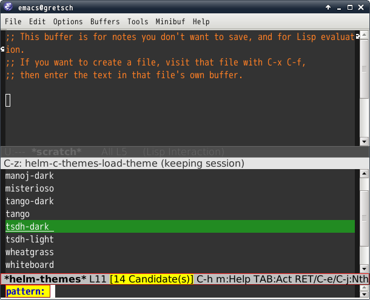

# helm-themes.el [![melpa badge][melpa-badge]][melpa-link] [![melpa stable badge][melpa-stable-badge]][melpa-stable-link]

## Introduction

`helm-themes.el` provides Emacs themes selection with helm interface.

You can set theme temporary by persistent action.

## Screenshot




## Requirements
* Emacs 24.3 or higher.
* helm 1.7.7 or higher


## Caution

`helm-themes.el` reset to original theme if you cancel to set theme(Such as `C-g`).
But `helm-themes.el` cannot reset original theme if you set your own color
setting for some faces.


## Basic Usage

Set themes with helm interface. This persistent action can set theme temporary.

```
M-x helm-themes
```

## Sample Configuration

```lisp
(require 'helm-config)
(require 'helm-themes)
```

[melpa-link]: https://melpa.org/#/helm-themes
[melpa-stable-link]: https://stable.melpa.org/#/helm-themes
[melpa-badge]: https://melpa.org/packages/helm-themes-badge.svg
[melpa-stable-badge]: https://stable.melpa.org/packages/helm-themes-badge.svg
